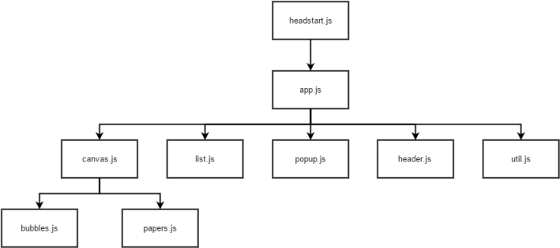

# Doc

## Installation and Deployment

See [Getting Started](../README.md#getting-started) for a minimal working example.

See [Installing and configuring the server](server_config.md) for instructions on how to install and configure the server.

## Configuration

At the moment, Headstart supports three different modes. The examples contain a complete setup for each of the three modes.

+ Show static maps *from a headstart server*
    
    Set the mode to `serve_static_files`, adjust the `server_url` and you are ready to go.

+ Show *local maps* from client-side

    In order to show local, pre-calculated maps adjust the `data-config.files` array to mirror your local file structure.

+ Perform queries against *third-party APIs* and create new maps

    `data-config.js` allows you to choose (currently) 1 of 2 possible repositories to query against. ("plos", "pubmed"). Follow the instructions in [HOWTO: Get the search repos example to work](howto_search_repos.md).

## Visualisation Settings

In order to change the look and behaviour of Headstart, adapt the options in `data-config.js` provided with each example. For an overview of all options, see `vis/js/default-config.js`

Basic settings include:

**General settings**

+ title - Title of the map
+ width - in px
+ height - in px

**Map settings**

Tweak these values to optimize bubble and paper sizes. 

+ max_diameter_size
+ min_diameter_size
+ max_area_size
+ min_area_size

**More settings**

+ TBD

To change the look of Headstart beyond these options, modify the actual SASS files in `vis/stylesheets`.

## Setting up a vanilla `index.html`

Our suggestion would be to build from the examples provided, but in case you want to start from scratch, here's a guidline

Three lines will set up the basics of Headstart.

    

                             // Headstart's div
      // Runtime Config
      // The Core Lib

## Input Data Format

Each input dataset consists of 12 entries per document.

1. **id** - Document ID
1. **title** - Title of the document
1. **readers** - Readers
1. **x** - Horizontal position on the map
1. **y** - Vertical postition on the map
1. **paper_abstract** - Abstract *optional*
1. **published_in** - Name of Journal *optional*
1. **year** - Year *optional*
1. **url** - URL (common prefix can be defined in the [options](#visualisation-settings))
1. **file_hash** - 
1. **authors** - Name of authors

## Architecture

*Important note*: The proposed architecture does not reflect the current status of Headstart. Main differences: Mediator `app.js` located within `headstart.js`; `header.js` located in `popup.js`; `util.js` not implemented

Headstart uses the *mediator pattern* (see [Addy Osmani's article](https://addyosmani.com/largescalejavascript/#mediatorpattern)). The current version has implemented the mediator and the channels for basic functionality, but logic has not been moved yet.

+ *app.js*

	The mediator. Has subscribed to all channels and receives events from the sub-modules which publish according to user interaction.

+ *canvas.js*
	
	Manages the actual map visualization.

+ *bubbles.js*

	Topic bubbles in the map.

+ *papers.js*

	Paper elements within the bubbles.

+ *list.js*

	The collapsable list of papers. `Map <-- Interaction --> List`

+ *popup.js*

	Manages the pop-up window that is used for the intro text and pdf previews.

+ *header.js*

	Content of the header above the map. Updated according to currently selected layer of the visualization.

+ *util.js*

	Contains following functionality:

	+ `RecordAction`
	+ `Bookmarking`
